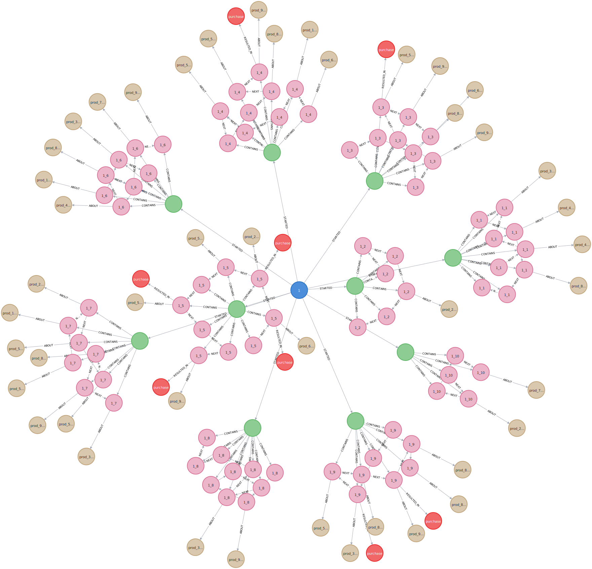

# Neo4j E-Commerce Clickstream and Transaction KG 🛒

A Neo4j-based toolkit for building and analyzing e-commerce knowledge graphs, supporting clickstream path analysis, funnel analysis, and more.

---
## 📦 Prerequisites
- Python 3.9
- Neo4j 4.2.10
- py2neo==2021.2.4
- pandas==2.3.0
- numpy==1.24.0
- tqdm

##  📁 Dataset

+  Source:  [E-commerce Clickstream and Transaction Dataset - Kaggle](https://www.kaggle.com/datasets/waqi786/e-commerce-clickstream-and-transaction-dataset?)
+ Features:
  - UserID: Unique identifier for each user.
  - SessionID: Unique identifier for each session.
  - Timestamp: Date and time of the interaction.
  - EventType: Type of event (e.g., page view, click, product view, add to cart, purchase).
  - ProductID: Unique identifier for products involved in interactions.
  - Amount: Amount of the transaction (for purchases).
  - Outcome: Target event (e.g., purchase).

## 🚀 Project Structure
Neo4j_Ecommerce/  
├─ data/ # Dataset root folder  
│  ├─ e_1example.json # Example file with 1 record  
│  ├─ ecommerce_300.json  # Sample file with 300 records  
│  ├─ ecommerce_all.json  # Full dataset with all records  
│  └─ ecommerce_clickstream_transactions.csv  #  Original CSV file  
│
├─ 2json.py  # Script to convert CSV to JSON  
├─ analyse_graph.py  # Script for graph analysis  
├─ build_graph.py  # Script to build the Neo4j graph  
├─ split.py  # Script to split the dataset into smaller files  
└─ README.md  # Project README file

## 🛠️ Graph Construction (build_graph.py)
### Nodes & Relations
From the e-commerce clickstream dataset (`UserID, SessionID, Timestamp, EventType, ProductID, Amount, Outcome`), we define 5 node types and 5 relations:

- **Nodes**: `User`, `Session`, `Event`, `Product`, `Outcome`  
- **Relations**:  
  - `STARTED`: `(User)-[:STARTED]->(Session)`  
  - `CONTAINS`: `(Session)-[:CONTAINS]->(Event)`  
  - `NEXT`: `(e_i)-[:NEXT {delta_s}]->(e_{i+1})`  
  - `ABOUT`: `(Event)-[:ABOUT]->(Product)`  
  - `RESULTED_IN`: `(Event)-[:RESULTED_IN {amount}]->(Outcome)`  

### Rationale
- `STARTED` links users and their sessions (unique `session_id = UserID_SessionID`).  
- `CONTAINS` groups events under a session.  
- `NEXT` preserves event order and time gaps.  
- `ABOUT` ties actions to products.  
- `RESULTED_IN` records outcomes (e.g. purchase, with amount).  

Together these form a closed loop:  
**who (User) → in which session → did what (Event) → on which product → with what result (Outcome).**
This structure supports all downstream analysis (conversion, funnel, path, etc.).  

### Example
Graph of all sessions for `UserID=1`:



## 🔍 Graph Analysis (analyse_graph.py)
### Top-3 Products (Views & Conversion)
Conversion complements view counts and shows true product value.  
1. Count `(Event)-[:ABOUT]->(Product)` as views.  
2. Collect sessions that viewed the product.  
3. Check if those sessions had `(Event)-[:RESULTED_IN]->(Outcome)` and compute session-level conversion.  
### Top-5 Customers
Identifying “power users” helps segmentation and targeted marketing.  
1. Traverse `(User)-[:STARTED]->(Session)-[:CONTAINS]->(Event)-[:RESULTED_IN]->(Outcome)` to count purchases.  
2. Collect purchased products for personalization.  

### Pre-Purchase Paths
Focus on the “last mile”: which actions lead directly to purchase.  
1. Anchor all purchase events.  
2. Step back two hops via `NEXT`.  
3. Count `(e3, e2)` combinations.  
**Advantage**: Path queries are natural in Neo4j.  

### Funnel Analysis
View → Click → AddToCart → Purchase shows where conversions drop.  
1. Build session sets: `S_view`, `S_click`, `S_cart`, `S_purchase`.  
2. Report counts, stage conversion, and cumulative rates.  
**Advantage**: Set operations map directly to Cypher (`WITH + collect(DISTINCT ...)`).

## ⚙️ Setup Instructions
1. Make sure Neo4j is running locally (default: http://localhost:7474)
and update your connection credentials in `build_graph.py` and `analyse_graph.py`:
```
Graph("http://localhost:7474", auth=("neo4j", "password"))
```
2. Transform the original CSV dataset to JSON format by running `2json.py`. 
If needed, you can split the dataset into a smaller file using split.py to get the subset of the original one.
3. Build the graph from dataset by running `build_graph.py`.
4. Run `analyse_graph.py` to perform analysis on the graph.

## 📊 Results
### 🎁 Top 3 Products (by views & conversion, session-level)

| Rank | ProductID | Views | Conversion |
|------|-----------|-------|------------|
| 1    | prod_4714 | 12    | 100.00%    |
| 2    | prod_6051 | 12    | 100.00%    |
| 3    | prod_9806 | 11    | 100.00%    |
### 👑 Top 5 Customers (by purchases)
| Rank | UserID | Purchases |
|------|--------|-----------|
| 1    | 510    | 22        |
| 2    | 479    | 21        |
| 3    | 761    | 21        |
| 4    | 327    | 20        |
| 5    | 455    | 20        |

### 👣 Two Steps Before Purchase
The most common pre-purchase patterns are page_view → click and product_view → page_view, showing that users typically browse first and then click through to product details.
Actions like login and add_to_cart also appear frequently before purchases, indicating multiple purchase paths.
### 🔁 Funnel Analysis

| Stage     | Sessions | Step Conv. | Cumulative |
|-----------|----------|------------|------------|
| View      | 9060     | -          | -          |
| Click     | 5993     | 66.15%     | 66.15%     |
| AddToCart | 3852     | 64.27%     | 42.52%     |
| Purchase  | 2398     | 62.25%     | 26.47%     |


## 🤔 Future Work
- [ ] **ALSO_VIEWED**: Products viewed together (per session or user) reveal substitution patterns.  
      Basis for “Users who viewed A also viewed B” recommendations.  

- [ ] **ALSO_BOUGHT**: Products purchased together capture complementarity or bundles.  
      Useful for cart recommendations and bundle strategies.  

- [ ] **SIMILAR_TO**: Combine `ALSO_VIEWED` and `ALSO_BOUGHT`, or compute similarity with GDS algorithms (cosine, embeddings).
- [ ] **...**

## 📜 License
MIT License